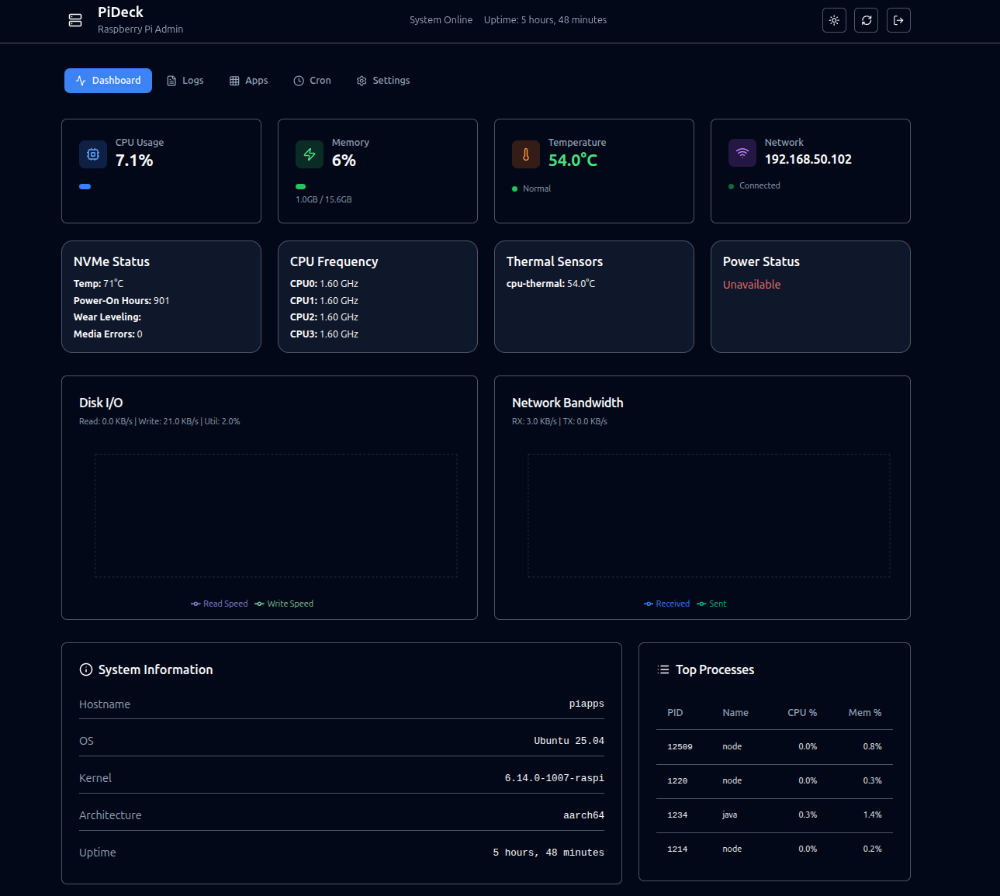

# PiDeck - Raspberry Pi Admin Dashboard

A sleek, full-stack web application for monitoring and managing Raspberry Pi servers. Built with modern technologies, PiDeck provides a centralized control hub for system monitoring, service management, and log analysis.



## 🚀 Features

### System Monitoring
- **Real-time Metrics**: CPU usage, memory consumption, system temperature
- **System Information**: Hostname, OS details, kernel version, uptime
- **Network Status**: IP address and connectivity monitoring

### Service Management
- **Docker Containers**: View, start, stop, and restart containers
- **PM2 Processes**: Monitor and manage Node.js applications
- **System Services**: Control various system processes

### Log Management
- **Log Viewer**: Browse and view log files from `/home/zk/logs/`
- **Real-time Updates**: Auto-refresh log content every 5 seconds
- **Log Download**: Export log files for offline analysis

### Task Scheduling
- **Cron Jobs**: View scheduled tasks and their status
- **Manual Execution**: Run cron jobs on-demand
- **Schedule Analysis**: Human-readable cron schedule interpretation

### User Interface
- **Dark Theme**: Optimized for server administration
- **Responsive Design**: Works on desktop and mobile devices
- **Real-time Updates**: Live data refresh without page reload
- **Intuitive Navigation**: Tab-based interface for easy access

## 🛠️ Tech Stack

### Backend
- **Node.js** with Express.js framework
- **TypeScript** for type safety
- **bcrypt** for password hashing
- **express-session** for session management
- **Shell integration** via `child_process`

### Frontend
- **React 18** with TypeScript
- **Vite** for fast development and building
- **TailwindCSS** for styling
- **Shadcn/ui** component library
- **TanStack Query** for server state management
- **Wouter** for client-side routing

### Database & Storage
- **PostgreSQL** with Drizzle ORM (production ready)
- **In-memory storage** for development
- **Session-based authentication**

## 🔧 Quick Start

### Prerequisites
- Node.js 18+ and npm
- Git
- Linux-based system (Ubuntu/Debian recommended)
- Optional: Docker and PM2 for full functionality

### Installation

1. **Clone the repository**
   ```bash
   git clone https://github.com/hexawulf/PiDeck.git
   cd PiDeck
   ```

2. **Install dependencies**
   ```bash
   npm install
   ```

3. **Start development server**
   ```bash
   npm run dev
   ```

4. **Access the dashboard**
   - Open http://localhost:5006
   - Login with password: `admin`

## 📖 Usage

### Initial Login
- Default password: `admin`
- Sessions last 24 hours
- Secure localhost-only access by default

### Navigation
- **Dashboard**: System overview and quick actions
- **Logs**: View system and application logs
- **Apps**: Manage Docker containers and PM2 processes
- **Cron**: Monitor and execute scheduled tasks

### Security Features
- bcrypt password hashing
- Session-based authentication
- HTTPS-ready configuration
- Localhost/LAN access restriction

## 🔐 Security Notes

- **Default Password**: It is crucial to change the default `admin` password immediately after the first login, especially in a production environment. This can be done via the user settings panel in the UI.
- **Environment Variables**: Sensitive configuration, such as the `DATABASE_URL` (for PostgreSQL connection) and `SESSION_SECRET` (for securing user sessions), must be managed using environment variables.
    - A `.env.example` file is provided as a template. Copy it to a `.env` file and populate it with your actual secrets.
    - The `.env` file is included in `.gitignore` and should never be committed to the repository.
- **Command Execution**: The application uses `child_process` to execute certain system commands for monitoring and management. This functionality has been reviewed to prevent command injection vulnerabilities (e.g., by validating inputs for PM2 process names and ensuring only predefined cron jobs can be executed).
- **Network Access**: By default, the application server binds to `0.0.0.0`, making it accessible on your local network. Configure firewall rules (e.g., `ufw`) to restrict access as needed, especially if the device is connected to a public network.
- **HTTPS**: For production deployments, always use a reverse proxy like NGINX or Caddy to enable HTTPS with valid SSL certificates. This encrypts traffic between clients and the server. See `docs/nginx/pideck.piapps.dev.conf` for an example NGINX configuration.
- **Session Security**: Sessions are configured to be HTTP-only (reducing XSS risk) and use `SameSite=Lax` cookies. Ensure your `SESSION_SECRET` is strong and unique. Sessions expire after 24 hours of inactivity.
- **Dependencies**: Regularly update dependencies (`npm update`) and audit them (`npm audit`) to patch known vulnerabilities. While this cleanup addressed some issues, ongoing vigilance is required.

## 🚀 Production Deployment

For production deployment instructions, see [docs/INSTALL.md](./docs/INSTALL.md)

### Quick Production Setup
```bash
# Build for production
npm run build

# Start with PM2
pm2 start dist/index.js --name pideck

# Setup NGINX reverse proxy (optional)
# See docs/INSTALL.md for full configuration
```

## 🔄 Live Demo

🌐 **[View Live Demo](https://pideck.piapps.dev)** *(pideck.piapps.dev)*

## 📚 Documentation

- [Installation Guide](./docs/INSTALL.md) - Detailed setup instructions
- [API Documentation](./docs/API.md) - Backend API reference
- [Contributing Guide](./CONTRIBUTING.md) - How to contribute
- [Changelog](./CHANGELOG.md) - Version history

## 🤝 Contributing

We welcome contributions! Please see our [Contributing Guide](./CONTRIBUTING.md) for details.

### Development Setup
1. Fork the repository
2. Create a feature branch: `git checkout -b feature/amazing-feature`
3. Make your changes and test thoroughly
4. Commit your changes: `git commit -m 'Add amazing feature'`
5. Push to the branch: `git push origin feature/amazing-feature`
6. Open a Pull Request

### Areas for Contribution
- Additional system metrics and monitoring
- Enhanced log parsing and filtering
- Mobile responsiveness improvements
- Multi-user authentication system
- Plugin system for custom integrations

## 📄 License

This project is licensed under the MIT License - see the [LICENSE](./LICENSE) file for details.

## 🙏 Acknowledgments

- Built with [Shadcn/ui](https://ui.shadcn.com/) for beautiful components
- Icons by [Lucide React](https://lucide.dev/)
- Inspired by server administration tools like Cockpit and Uptime Kuma

## 📞 Support

- 📧 **Email**: [dev@0xwulf.dev](mailto:dev@0xwulf.dev)
- 🐛 **Issues**: [GitHub Issues](https://github.com/hexawulf/PiDeck/issues)
- 💬 **Discussions**: [GitHub Discussions](https://github.com/hexawulf/PiDeck/discussions)

---

**Made with ❤️ for the Raspberry Pi community by 0xWulf**
